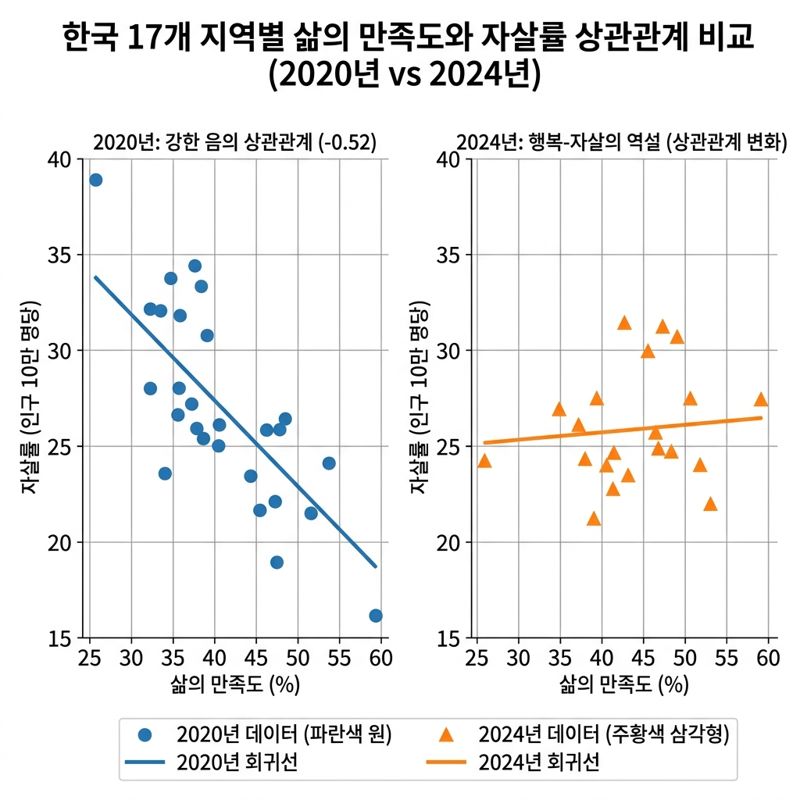
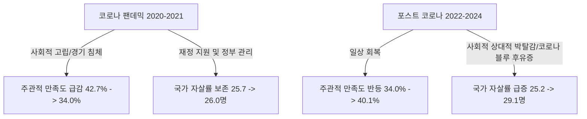
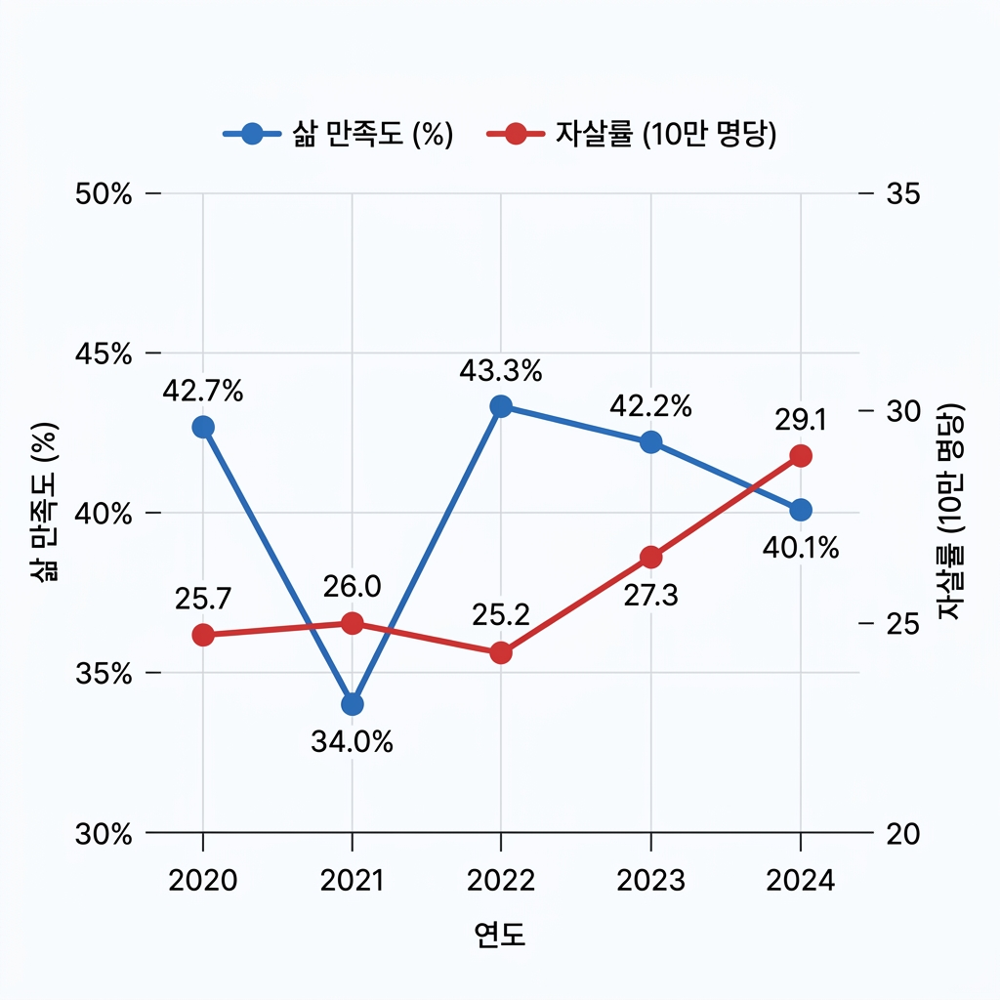

# 📊 삶의 만족도와 자살률의 상관관계 분석 보고서 (2020년 ~ 2024년)

## 1. 요약 (Executive Summary)
본 보고서는 2020년부터 2024년까지의 **시도별 주관적 삶의 만족도**와 **인구 10만 명당 자살률** 데이터를 연계하여 시공간적 상관관계를 분석한 결과입니다.

* **초기 코로나 시기(2020년)의 뚜렷한 음의 상관관계**: 2020년에는 삶의 만족도가 높은 지역일수록 자살률이 유의미하게 낮게 나타나는 전형적인 패턴이 관찰되었습니다 (상관계수 $r = -0.52$).
* **시간 경과에 따른 상관관계 약화 및 역설 발생**: 해가 갈수록 두 지표 간의 음의 상관관계는 약화되었으며, 2024년에는 주관적 만족도 점수가 높은 지역이 오히려 자살률도 높은 **'행복-자살 역설(Happy-Suicide Paradox)'** 형태가 관찰되었습니다 ($r = +0.23$).
* **성별에 따른 뚜렷한 격차**: 
  * **남성**의 경우 삶의 만족도와 자살률 간의 음의 상관관계가 상대적으로 명확하게 나타나다가 최근에 약화되었습니다.
  * **여성**의 경우 두 지표 간의 상관관계가 매년 0에 가깝게 관찰되어, 여성의 주관적 만족도와 자살률은 다소 독립적인 요인들에 의해 결정됨을 시사합니다.
* **전국 평균 시계열의 역설**: 2021년 팬데믹 심화기에는 만족도가 급감(34.0%)했음에도 자살률은 26.0명으로 유지된 반면, 2024년에는 만족도가 40.1%로 회복되었음에도 자살률이 29.1명으로 급증하는 거시적 역설을 보였습니다.

---

## 2. 분석 데이터 및 방법론
* **분석 대상 파일**:
  1. `삶의_만족도_시도__20260606195059.xlsx` (주관적 삶의 만족도 비율 및 5점 척도 분포)
  2. `인구십만명당_자살률_시도_시_군_구__20260606194913.xlsx` (인구 10만 명당 자살률, 성별 구분)
* **분석 범위**: 전국 및 17개 광역지방자치단체 (2020년 ~ 2024년, 5개년)
* **지표 재정의**:
  * **만족 비율 (Satisfied Rate)**: '매우 만족' 비율(%) + '약간 만족' 비율(%)
  * **불만 비율 (Dissatisfied Rate)**: '약간 불만족' 비율(%) + '매우 불만족' 비율(%)
  * **만족도 점수 (Satisfaction Score)**: 5점 리커트 척도 기반 가중평균값 계산
    $$\text{Score} = \frac{(5 \times \text{매우만족}) + (4 \times \text{약간만족}) + (3 \times \text{보통}) + (2 \times \text{약간불만족}) + (1 \times \text{매우불만족})}{100}$$
* **통계 방법**: 피어슨 상관계수(Pearson Correlation Coefficient, $r$) 산출

---

## 3. 주요 분석 결과

### 3.1. 연도별 및 통합 상관계수 현황
아래 표는 17개 시도 데이터를 기준으로 연도별 크로스섹션(Cross-sectional) 상관관계 및 5개년 통합(Pooled, N=85) 상관관계를 보여줍니다.

| 구분 (지표 간 상관계수 $r$) | 2020년 | 2021년 | 2022년 | 2023년 | 2024년 | 통합 (N=85) |
| :--- | :---: | :---: | :---: | :---: | :---: | :---: |
| 👥 **전체 (Total)** | | | | | | |
| 만족 비율 vs 자살률 | **-0.5226** | -0.1126 | -0.0077 | -0.2396 | +0.0386 | **-0.1704** |
| 만족 점수 vs 자살률 | **-0.5135** | +0.0499 | +0.0771 | -0.1087 | +0.2296 | -0.0477 |
| 불만 비율 vs 자살률 | +0.1074 | -0.3566 | -0.2034 | -0.0039 | -0.4870 | -0.1767 |
| 🧑 **남성 (Male)** | | | | | | |
| 만족 비율 vs 자살률 | **-0.5446** | +0.0158 | +0.1431 | -0.1897 | +0.0569 | -0.1208 |
| 만족 점수 vs 자살률 | **-0.5601** | +0.1442 | +0.2254 | -0.1120 | +0.2277 | -0.0313 |
| 불만 비율 vs 자살률 | +0.2549 | -0.4153 | -0.3007 | +0.0421 | **-0.5495** | -0.1765 |
| 👩 **여성 (Female)** | | | | | | |
| 만족 비율 vs 자살률 | -0.0488 | -0.1667 | -0.0510 | +0.1302 | +0.1419 | -0.0422 |
| 만족 점수 vs 자살률 | +0.0237 | -0.1474 | -0.0976 | +0.2462 | +0.1241 | +0.0141 |
| 불만 비율 vs 자살률 | -0.1288 | -0.0972 | +0.0870 | -0.1365 | +0.0256 | -0.0674 |

> [!NOTE]
> * **상관계수 해석 기준**: 
>   * $\pm0.5$ 이상: 강한 상관관계 (붉은색 굵은 표시)
>   * $\pm0.1 \sim \pm0.3$: 약한 상관관계
>   * $\pm0.1$ 미만: 상관관계 없음

#### 📉 삶의 만족도와 자살률의 지역별 분포 및 상관관계 비교 (2020 vs 2024)
아래 분포도는 2020년의 뚜렷한 음의 상관관계가 2024년에 역설적인 형태(우상향 혹은 산포)로 변화하는 양상을 보여줍니다.

---

### 3.2. 시기별 상세 분석

#### 📌 2020년: 전형적인 음의 상관관계 (자살 방어 인자로서의 만족도)
* 2020년에는 전체 인구 기준 만족도 점수와 자살률 간의 상관계수가 **-0.5135**로 뚜렷한 음의 관계를 보였습니다.
* **세종특별자치시**가 높은 삶의 만족도(58.7%)와 가장 낮은 자살률(18.4명)을 기록한 반면, **충청남도**는 가장 낮은 삶의 만족도(36.8%)와 높은 자살률(34.7명)을 보였습니다. 
* 이는 주관적인 삶의 만족도가 지역 사회의 자살률을 낮추는 전통적인 방어 기제로 충실히 작동했음을 나타냅니다.

#### 📌 2024년: '행복-자살 역설 (Happy-Suicide Paradox)'의 출현
* 2024년에는 주관적 만족 점수와 자살률 간의 상관계수가 **+0.2296**으로 오히려 **양의 상관관계**를 나타내는 이례적인 현상이 포착되었습니다.
* **충청남도**는 삶의 만족도 점수가 3.555점으로 17개 시도 중 1위였으나, 자살률 역시 34.8명으로 전체 2위를 기록했습니다. **제주특별자치도** 역시 만족도 점수(3.442점, 공동 3위)가 높았으나 자살률(36.3명, 1위)도 가장 높았습니다.
* 반면, **인천광역시**는 삶의 만족도 비율이 28.0%로 최하위였음에도 자살률(31.2명)은 중간 수준에 머물렀습니다.

---

### 3.3. 성별 차이 분석
* **남성의 높은 지표 민감성**: 남성은 2020년 만족 점수와 자살률 간의 상관계수가 **-0.5601**에 달할 정도로 주관적 삶의 질이 자살률에 강력하게 동조되는 양상을 보였습니다. 
* **여성의 독립성**: 여성은 5개년 내내 상관계수가 $\pm0.15$ 범위 내에 머물러 삶의 만족도와 자살률 간에 통계적 관계가 발견되지 않았습니다. 이는 여성이 삶의 만족도가 낮더라도 이것이 자살률 증가로 직결되지 않으며, 다른 사회화 및 지지 메커니즘이 존재함을 시사합니다.

---

### 3.4. 전국 거시 시계열 트렌드 (2020년~2024년)
국가 전체 평균의 흐름 또한 흥미로운 역설적 추세를 보입니다.

* **2021년 팬데믹 충격기**: 전국 삶의 만족도(Satisfied Rate)는 2020년 42.7%에서 2021년 34.0%로 **8.7%p 대폭 하락**했습니다. 그러나 국가 전체 자살률은 25.7명에서 26.0명으로 거의 변화가 없었습니다.
* **2024년 포스트 코로나 기**: 만족도 비율은 40.1%로 크게 회복되었으나, 오히려 자살률은 **29.1명으로 급증**하여 최근 5개년 중 최고치를 기록했습니다.

#### 📈 전국 단위 시계열 추이 그래프 (2020 ~ 2024)
아래 시계열 그래프는 2021년 코로나 팬데믹 시기의 만족도 급락 및 2024년 포스트 코로나 시기의 만족도 회복과 자살률 상승이 동반되는 '시계열 역설'을 직관적으로 나타냅니다.

---

### 3.5. 주요 기초 통계표 (Key Statistical Tables)

#### ① 전국 단위 시계열 지표 추이 (2020년 ~ 2024년)
전국 평균 주관적 삶의 만족도와 자살률의 연도별 성별 원데이터(Raw Data)입니다.

| 연도 | 성별 구분 | 만족 비율 (%) | 만족 점수 (5점 만점) | 자살률 (인구 10만 명당) |
| :---: | :---: | :---: | :---: | :---: |
| **2020년** | **전체** | 42.7% | 3.423 | 25.7 |
| | 남성 | 43.5% | 3.443 | 35.5 |
| | 여성 | 41.9% | 3.397 | 15.9 |
| **2021년** | **전체** | 34.0% | 3.161 | 26.0 |
| | 남성 | 33.8% | 3.155 | 35.9 |
| | 여성 | 34.3% | 3.174 | 16.2 |
| **2022년** | **전체** | 43.3% | 3.388 | 25.2 |
| | 남성 | 43.4% | 3.389 | 35.3 |
| | 여성 | 43.2% | 3.382 | 15.1 |
| **2023년** | **전체** | 42.2% | 3.366 | 27.3 |
| | 남성 | 42.5% | 3.373 | 38.3 |
| | 여성 | 42.0% | 3.366 | 16.5 |
| **2024년** | **전체** | 40.1% | 3.367 | 29.1 |
| | 남성 | 40.5% | 3.377 | 41.8 |
| | 여성 | 39.7% | 3.358 | 16.6 |

 

#### ② 시도별 통계비교: 2020년 vs 2024년 (전체 인구 기준)
상관관계 양상이 극명하게 대비되는 두 시점(2020년 vs 2024년)의 지역별 주관적 만족 지표와 실제 자살률 비교 테이블입니다. (자살률이 낮은 순으로 정렬)

| 시도명 | 2020년 만족 비율 | 2020년 만족 점수 | 2020년 자살률 | 2024년 만족 비율 | 2024년 만족 점수 | 2024년 자살률 | 자살률 변동폭 |
| :--- | :---: | :---: | :---: | :---: | :---: | :---: | :---: |
| **세종특별자치시** | 58.7% | 3.742 | 18.4 | 42.8% | 3.351 | 23.0 | +4.6 |
| **서울특별시** | 46.4% | 3.462 | 22.7 | 46.3% | 3.442 | 24.1 | +1.4 |
| **경기도** | 44.3% | 3.445 | 23.7 | 35.7% | 3.310 | 28.2 | +4.5 |
| **경상남도** | 45.9% | 3.476 | 25.3 | 42.9% | 3.397 | 28.5 | +3.2 |
| **울산광역시** | 40.7% | 3.397 | 26.4 | 40.6% | 3.425 | 29.2 | +2.8 |
| **대구광역시** | 33.2% | 3.253 | 26.1 | 36.1% | 3.217 | 29.4 | +3.3 |
| **광주광역시** | 43.4% | 3.464 | 22.6 | 40.7% | 3.415 | 29.9 | +7.3 |
| **부산광역시** | 40.1% | 3.373 | 27.4 | 37.5% | 3.316 | 30.3 | +2.9 |
| **대전광역시** | 41.3% | 3.411 | 27.2 | 47.2% | 3.521 | 31.2 | +4.0 |
| **인천광역시** | 42.4% | 3.415 | 26.5 | 28.0% | 3.218 | 31.2 | +4.7 |
| **경상북도** | 34.4% | 3.293 | 28.6 | 40.9% | 3.350 | 31.6 | +3.0 |
| **충청북도** | 40.5% | 3.380 | 27.1 | 40.7% | 3.390 | 31.8 | +4.7 |
| **전북특별자치도** | 41.1% | 3.392 | 27.8 | 44.8% | 3.380 | 32.3 | +4.5 |
| **강원특별자치도** | 45.8% | 3.453 | 33.2 | 42.2% | 3.427 | 34.3 | +1.1 |
| **전라남도** | 40.9% | 3.436 | 28.5 | 40.2% | 3.343 | 34.5 | +6.0 |
| **충청남도** | 36.8% | 3.369 | 34.7 | 47.0% | 3.555 | 34.8 | +0.1 |
| **제주특별자치도** | 47.9% | 3.508 | 30.0 | 43.4% | 3.442 | 36.3 | +6.3 |
| **전국 평균** | **42.7%** | **3.423** | **25.7** | **40.1%** | **3.367** | **29.1** | **+3.4** |

---

## 4. 고찰: '행복-자살 역설'의 사회학적 해석
왜 전반적으로 삶의 만족도가 높은 지역이나 시기에서 자살률이 오히려 높거나 증가하는 역설적인 현상이 나타날까요?

1. **상대적 박탈감 이론 (Relative Deprivation Theory)**
   * 주변 사람들이 모두 행복하고 만족스럽다고 느낄 때(예: 만족도 1위 충남, 대전), 개인적으로 불행함을 느끼는 취약 계층은 자신의 불행을 더욱 극대화하여 인지하게 됩니다. 즉, '비교 대상'이 너무 밝아 자신의 어둠이 더 짙어지는 효과입니다.
2. **평균의 함정 (Ecological Fallacy)**
   * 삶의 만족도 조사는 일반 표본 집단의 '평균적인 주관적 행복감'을 대변합니다. 반면 자살은 극단적 사회적 고립, 심각한 정신 질환, 급격한 경제적 붕괴 등 한계 선상에 놓인 소수의 취약 계층에서 발생합니다. 지역 사회가 전반적으로 윤택해지더라도 취약 계층의 사회안전망이 붕괴된다면 두 지표는 디커플링(Decoupling)될 수 있습니다.
3. **포스트 코로나의 '지연된 충격'**
   * 팬데믹 기간(2021~2022)에는 국가적인 재정 지원과 긴급 대출, 재난지원금 등으로 한계 가구의 파산이 유예되었고, '전국민적 국가 재난'이라는 심리적 일체감(Shared Adversity)이 작동하여 자살률 증가가 억제되었습니다. 그러나 2024년에 이르러 경제 지원이 정상화되고 일상이 복구되면서 누적된 경제적 피해와 고립의 누적 효과가 본격적으로 표출된 것으로 분석됩니다.

---

## 5. 결론 및 제언
본 분석은 **"주관적인 삶의 만족도가 높은 사회가 반드시 자살로부터 안전한 사회는 아니다"**라는 경종을 울립니다.

> [!IMPORTANT]
> **정책적 시사점**:
> 1. **평균 지표 중심 정책의 한계 탈피**: 지역 사회의 삶의 만족도 평균을 높이는 거시적 정책(예: 인프라 확충, 소득 증대)만으로는 취약 계층의 자살을 예방하기 어렵습니다. 
> 2. **상대적 박탈감 관리**: 행복지수가 높은 자치단체일수록 고립된 1인 가구, 한계 자영업자 등 소외 계층을 모니터링하는 맞춤형 사회적 지지망 구축이 시급합니다.
> 3. **성별 맞춤형 예방 체계**: 삶의 만족도 변동에 크게 흔들리는 남성 자살 예방을 위해서는 직업적/경제적 안전망 확보가 중요하며, 만족도와 자살률이 독립적인 여성의 경우 심리 치료 및 관계 중심적 돌봄 체계 고도화가 요구됩니다.
